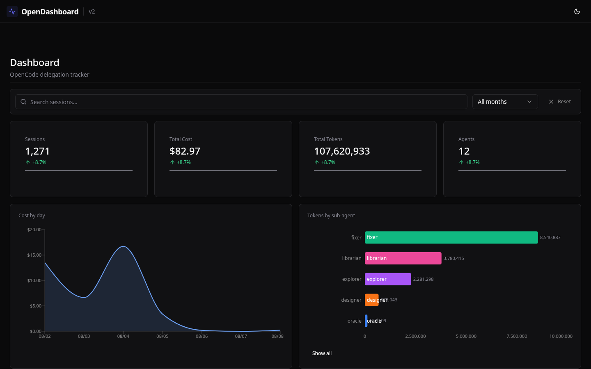
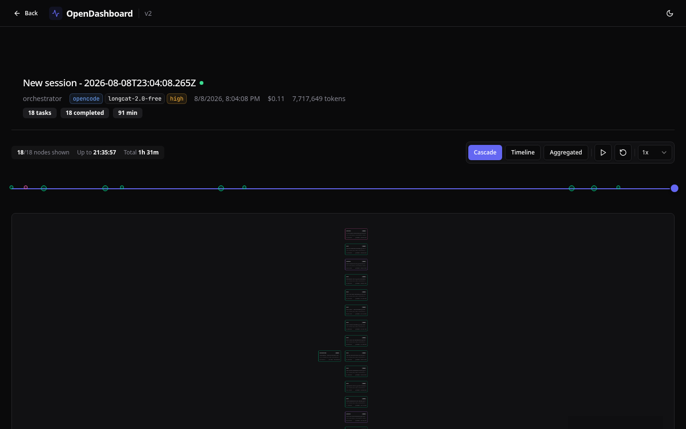
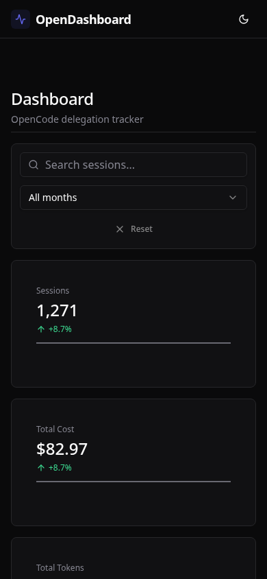

<div align="center">

# OpenDashboard

**Visualize OpenCode agent delegation chains, costs, and token usage.**

[](LICENSE)
[](https://www.python.org/downloads/)

</div>

<p align="center">
  
</p>

## What it is

OpenDashboard reads the OpenCode SQLite database **read-only** and renders an interactive view of your agent delegation chains. When you run multi-agent workflows in OpenCode, cost, token spend, and the structure of those chains are invisible from the CLI. This surfaces them.

The app requires no configuration -- it connects to the OpenCode database at `~/.local/share/opencode/opencode.db` automatically.

## Features

### Dashboard

- KPI tiles: sessions, cost, tokens, active agents
- Cost-over-time chart
- Cost and token breakdown by sub-agent (orchestrator excluded -- it is the parent, not a sub-agent)
- Cost by model
- Session table with sort, search, filter, column toggles, and density toggle

### Session trace

- Interactive delegation graph (React Flow) with drag, zoom, pan, MiniMap
- Timeline scrubber with playback to step through delegation as it happened
- Focus mode to isolate a single delegation branch
- Node detail drawer showing per-task cost, tokens, model, and timing
- Live SSE tail for in-flight sessions (auto-updates without refresh)

### Integration

- Reads the OpenCode SQLite database **read-only** (`PRAGMA query_only`)
- Optional OpenCode plugin that auto-starts the dashboard as a machine-wide singleton

## Quick start

```bash
uv sync
uv run opendashboard
# → http://127.0.0.1:8420
```

OpenCode must have been run at least once (this creates the database). No other setup is needed.

## Screenshots

<p align="center">
  
  <br />
  <em>Session detail: interactive delegation graph with timeline scrubber and node details.</em>
</p>

<p align="center">
  
  <br />
  <em>Mobile layout: responsive design for on-the-go inspection.</em>
</p>

## Development

`make dev` starts both the FastAPI backend and the Vite dev server (with HMR) in a single command.

```bash
make dev
# → SPA (Vite dev): http://127.0.0.1:5173
# → API (FastAPI):   http://127.0.0.1:8420/api/*
```

Vite proxies `/api` and `/static` to the backend, so no backend restarts are needed during frontend development.

**Production build:**

```bash
cd frontend
npm run build   # → ../src/opendashboard/static/ (index.html + assets/)
```

FastAPI serves the built SPA at `/` and the JSON API at `/api/*` from the same server.

**Frontend tests:**

```bash
npx vitest run          # unit tests
npx playwright test     # end-to-end tests
```

## Architecture

```
┌──────────────┐     ┌──────────────────────┐     ┌──────────────────────────┐
│ OpenCode DB  │────▶│ FastAPI (read-only)   │────▶│ React SPA                │
│ SQLite       │     │ Python 3.12           │     │ Vite 5 · React 19        │
│ query_only   │     │ JSON API + SSE        │     │ React Flow · TanStack    │
└──────────────┘     └──────────────────────┘     └──────────────────────────┘
```

The backend is a pure JSON API. All rendering happens client-side in the React SPA. The database is opened with `PRAGMA query_only = 1` so OpenDashboard never writes to the OpenCode database.

## Configuration

| Option | Default | Description |
|--------|---------|-------------|
| `OPENDASHBOARD_PORT` | `8420` | Environment variable to override the server port |
| `--port` | `8420` | CLI flag to override the server port |

No other configuration is required. The app reads the OpenCode database from `~/.local/share/opencode/opencode.db`.

## Documentation

| File | Contents |
|------|----------|
| [docs/README.md](docs/README.md) | Project overview, quick start, architecture diagram, UI layout |
| [docs/architecture.md](docs/architecture.md) | Stack, route map, data flow, SSE live tail, design decisions |
| [docs/trace-visualization.md](docs/trace-visualization.md) | Delegation graph rendering, timeline slider, focus mode, live tail |
| [docs/api-reference.md](docs/api-reference.md) | API endpoint documentation |
| [docs/tutorial-getting-started.md](docs/tutorial-getting-started.md) | Getting started tutorial |
| [docs/howto-add-route.md](docs/howto-add-route.md) | How to add new API routes |
| [docs/explanation-architecture-decisions.md](docs/explanation-architecture-decisions.md) | Architecture decision records |
| [frontend/README.md](frontend/README.md) | Frontend structure, scripts, dev workflow, adding components |

## License

[MIT](LICENSE)
