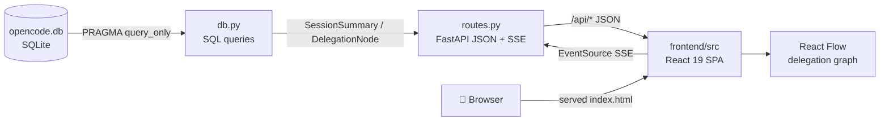

# OpenDashboard

**Real-time visualizer for OpenCode agent delegation chains.**

OpenDashboard is a web app built with **FastAPI + Vite + React** that reads the
OpenCode SQLite database and renders a delegation graph (React Flow) plus a
live SSE tail. It lets you explore agent sessions, inspect delegation chains,
and monitor cost/tokens of each call.

---

## Quick Start

```bash
# Install dependencies (first time only)
uv sync
cd frontend && npm install --legacy-peer-deps && cd ..

# Start backend + frontend together
make dev
# → SPA (Vite dev): http://127.0.0.1:5173  ·  API: http://127.0.0.1:8420/api/*
```

`make dev` runs `scripts/dev.sh`: it starts the FastAPI backend in the
background (`uv run opendashboard`, port 8420), waits 2s, and starts the Vite
dev server (port 5173) with HMR. Vite proxies `/api` and `/static` to the
backend; on exit the script kills the backend. To run the backend alone:
`uv run opendashboard` → http://127.0.0.1:8420 (serves the built SPA at `/`).

**Requirements:** Python ≥3.12, Node ≥20, OpenCode run at least once (creates
the DB).

---

## Architecture Overview



| Layer | Tech | Role |
|-------|------|------|
| Data | SQLite (read-only) | OpenCode session DB at `~/.local/share/opencode/opencode.db` |
| Backend | FastAPI + Python 3.12 | JSON API routes, DB queries, SSE live tail |
| Frontend | Vite 5 + React 19 + TypeScript | SPA: dashboard, graph, filters, theme |
| Graph | React Flow 12 + dagre | Delegation chain visualization |
| Data fetching | TanStack Query 5 | `/api/*` hooks with `refetchInterval` |
| Styling | Tailwind 4 + shadcn/Tremor | Dark/light theming, KPI cards, charts |

---

## UI Layout

```
┌──────────────────────────────────────────────────┐
│  OpenDashboard — Agent delegation visualizer      │
├──────────────┬───────────────────────────────────┤
│  Sidebar     │  Main Panel (React SPA)           │
│              │                                   │
│  Theme       │  Dashboard: KPI cards (sessions,   │
│  toggle      │  cost, tokens, agents)             │
│  ──────────  │  Charts: sessions/cost/tokens      │
│  Filters:    │  over time, agents breakdown       │
│  Agent       │  Session list (title/agent/model/  │
│  Month       │  cost/tokens/timestamps)           │
│  Search      │                                   │
│  ──────────  │  Session view: header + summary    │
│  Session     │  chips + timeline slider +         │
│  list        │  React Flow delegation graph       │
└──────────────┴───────────────────────────────────┘
```

- **Sidebar:** theme toggle, dashboard filters (agent/month/search).
- **Dashboard:** KPI cards, time-series/agent charts, session list linking to
  `/session/:id`.
- **Session view:** header + summary chips, timeline slider, React Flow
  delegation graph with drag/zoom/pan, live SSE tail.

---

## Project Structure

```
src/opendashboard/
├── __init__.py       # Package init, exports main/app
├── __main__.py       # Entry point: calls main()
├── main.py           # FastAPI app factory, static mount, uvicorn runner
├── config.py         # Constants: paths, port, version
├── db.py             # SQLite read-only queries (cached connection)
├── models.py         # Pydantic models + build_tree()
├── routes.py         # /api/* JSON routes + SSE + SPA catch-all
└── static/           # Vite build output (index.html + assets/) — do not edit

frontend/
├── src/pages/        # dashboard, session-detail, not-found
├── src/features/     # dashboard/ + session/ feature components
├── src/components/ui/# shadcn primitives
├── src/lib/          # TanStack Query hooks, formatting, graph layout
└── vite.config.ts    # dev proxy, outDir → ../src/opendashboard/static/
```

---

## Key Design Decisions

| Decision | Rationale |
|----------|-----------|
| **FastAPI JSON API + React SPA** | Clear API contract, client-side rendering, no server-side HTML |
| **SQLite PRAGMA query_only** | Guarantees safety — never writes to the OpenCode DB |
| **Cached connection + threading.Lock** | Avoids repeated connections; thread-safe for dev |
| **SSE live tail with idle close** | Live updates without polling; no leaked streams |
| **React Flow + dagre layout** | Interactive hierarchical graph, handles hundreds of nodes |
| **Vite outDir → static/** | One production server: FastAPI serves API + SPA |

---

## Dependencies

- `fastapi` — Web framework
- `uvicorn[standard]` — ASGI server
- `aiosqlite` — Async SQLite (reserved for future use)
- Dev: `pytest`, `pytest-asyncio`, `httpx`
- Frontend: see `frontend/package.json` (React 19, Vite 5, React Flow 12,
  TanStack Query 5, Tremor, Tailwind 4)

---

## Links

- [Architecture deep-dive](architecture.md) — Stack, routes, data flow, SSE
- [Trace visualization details](trace-visualization.md) — Graph rendering, timeline, focus mode, live tail
- [Frontend structure](../frontend/README.md) — Scripts, components, dev workflow
