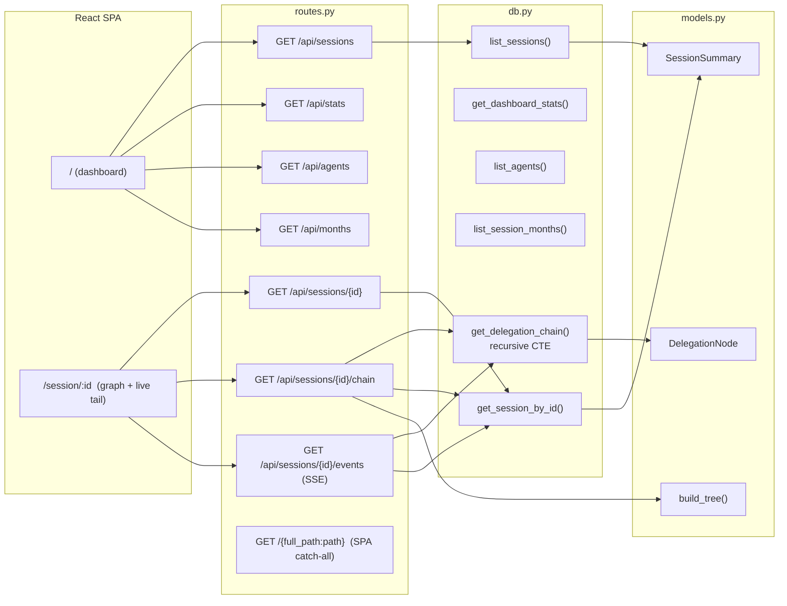

# Architecture

## Stack

```
┌────────────────────────────────────────────────────────┐
│  Browser (Chrome/Firefox/Safari)                        │
│  React 19 SPA · React Flow 12 · TanStack Query 5        │
│  Tailwind 4 · Tremor 3 · next-themes (dark/light)       │
├────────────────────────────────────────────────────────┤
│  Dev: Vite 5 dev server (:5173) — proxies /api, /static │
│  Prod: static assets served by FastAPI from /static     │
├────────────────────────────────────────────────────────┤
│  uvicorn 0.49+        ASGI Server                       │
│  FastAPI 0.136+       Web Framework (JSON API + SSE)    │
├────────────────────────────────────────────────────────┤
│  Python 3.12+          stdlib sqlite3                   │
├────────────────────────────────────────────────────────┤
│  SQLite (read-only)    opencode.db                      │
│  ~/.local/share/opencode/opencode.db                    │
└────────────────────────────────────────────────────────┘
```

**Dependency count:** 4 runtime Python packages; the frontend is a build-time
bundle (no server-side template rendering).

---

## Frontend

The SPA lives in `frontend/` and talks to FastAPI exclusively over JSON.

- **Vite 5 + React 19 + TypeScript** — build tooling and app runtime, strict
  TS config, `@/` alias to `src/`.
- **React Flow 12 (`@xyflow/react`)** — delegation graph rendering: custom
  nodes, dagre hierarchical layout, drag/zoom/pan, MiniMap, Controls.
- **TanStack Query v5** — data fetching for `/api/*` with `queryKey`-based
  caching and `refetchInterval` for live-ish dashboard refresh.
- **SSE live tail** — `useSessionEvents` hook wraps `EventSource` on
  `/api/sessions/{id}/events` and merges `node:new`/`session:updated` events
  into the graph + summary in place.
- **Theme light/dark** — `next-themes` provider toggling Tailwind CSS
  variables; shadcn/Tremor components consume the same tokens.

Production build (`npm run build`) writes to `src/opendashboard/static/`;
FastAPI serves it from `/` via the SPA catch-all. In dev, Vite's proxy
(`/api`, `/static` → `127.0.0.1:8080`) keeps a single backend process.

---

## Route Map



| Route | Purpose |
|-------|---------|
| `GET /api/sessions` | Session list (query: `limit`, `search`, `agent`, `month`) |
| `GET /api/sessions/{id}` | Single session summary (404 when missing) |
| `GET /api/sessions/{id}/chain` | Flat `DelegationNode` list + tree + trace summary |
| `GET /api/stats` | Aggregate stats (sessions, cost, tokens, agents) |
| `GET /api/agents` | Distinct agent names |
| `GET /api/months` | Distinct year-month buckets |
| `GET /api/sessions/{id}/events` | SSE stream: `node:new`, `session:updated`, heartbeat, idle close |
| `GET /{full_path:path}` | SPA catch-all — serves built `index.html` for any non-`/api` GET |

Route declaration order matters: `/api/*` first, SPA catch-all last, so no
specific route is shadowed.

---

## Data Flow

```
opencode.db (SQLite)
  │
  ▼
db.py
  ├── get_db()          → cached connection, PRAGMA query_only
  ├── list_sessions()   → WHERE + ORDER BY + LIMIT
  ├── get_dashboard_stats() → COUNT, SUM aggregations
  ├── list_agents()     → DISTINCT agent
  ├── list_session_months() → year-month buckets
  ├── get_delegation_chain() → WITH RECURSIVE CTE
  └── get_session_by_id() → single row lookup
  │
  ▼
models.py
  ├── SessionSummary    → Pydantic, from_row()
  ├── DelegationNode    → Pydantic w/ children list
  └── build_tree()      → flat list → hierarchy (parent_id mapping)
  │
  ▼
routes.py
  ├── compute_trace_summary() → aggregate stats from nodes
  └── /api/* handlers → JSONResponse (to_dict)
  │
  ▼
React SPA
  ├── TanStack Query → dashboard/chart/graph data
  ├── EventSource → live tail (node:new / session:updated)
  └── React Flow → graph canvas, dagre layout
```

**Key:** The backend is a pure JSON API. All rendering happens client-side in
the React SPA; no HTML is generated server-side.

---

## Design Decisions & Rationale

### Read-only database access
`PRAGMA query_only = 1` guarantees OpenDashboard never modifies the OpenCode
database. No writes, no conflicting locks, no corruption risk.

### Cached connection singleton
`get_db()` keeps a single cached SQLite connection behind a `threading.Lock`
with double-checked locking. Safe because FastAPI runs one process with async
workers and the connection is only touched from the event loop (plus
single-threaded TestClient).

### Recursive CTE for delegation chains
`get_delegation_chain()` fetches the whole delegation chain in one round trip
with a recursive CTE instead of N+1 queries.

### Server-side tree building
`build_tree()` converts the flat CTE result into a nested hierarchy using an
O(n) `node_map`. The flat list also feeds the React Flow graph directly (edges
derived client-side from `parent_id`).

### SSE live tail with idle close
The events endpoint polls the read-only connection every 2s, diffs new nodes
by `time_created`, emits framed `data: <json>` events, sends `: ping`
heartbeats every 15s, and closes the stream after 300s of no activity so idle
clients never leak.

### No server-side templating
Jinja2 templates and `static/style.css` were removed with the legacy HTMX
frontend (change `modernize-frontend-vite-react-flow`); the FastAPI server
serves only JSON + the static SPA bundle.

---

## DB Schema (relevant columns)

```sql
-- Table: session
-- Source: opencode.db (read-only)
SELECT
    id, parent_id, project_id, agent, model, title,
    time_created, time_updated,
    cost, tokens_input, tokens_output,
    tokens_reasoning, tokens_cache_read, tokens_cache_write
FROM session;
```

- `parent_id` → nullable; `NULL` indicates a root session
- `time_created`/`time_updated` → Unix timestamps in milliseconds
- Delegation: `session.parent_id REFERENCES session.id`
